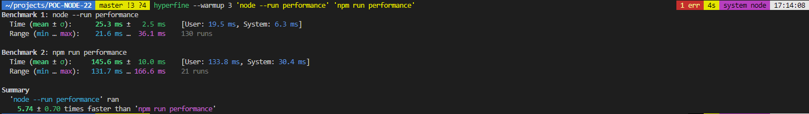

# POC-NODE-22

#### Running package.json scripts

No need to use the following command `npm run watch`, you can use node directly:

```bash
$ node --run watch
```

It will run the watch script located in the `package.json`.

#### Watch Mode

Run the following command:

```bash
$ npm run watch
```

If you modify the `index.js` in the `watched` folder, the node will restart with the new code automatically.

You can test the performance between the two version with this:

```bash
$ hyperfine --warmup 3 'node --run performance' 'npm run performance'
```



#### Websocket Client

No need of dependencies for connection a node script to a websocket server.

```bash
$ cd websocket/server
$ npm run dev
```

You can now connect to the websocket server without any dependencies in the file `index.js` in the folder `websocket`.

```js
const socket = new WebSocket("ws://localhost:8080");

// Connection opened
socket.addEventListener("open", () => {
  socket.send("Hello Server!");
});
```

#### Glob/GlobSync

No need to import the glob function from [Glob npm](https://www.npmjs.com/package/glob).
You can use it directly from node:fs directly. Run the following command and check the content of the file `index.js` in the directory `glob`.

```bash
$ npm run glob
```

#### Improve performance of AbortSignal creation

Run the bun server, I am using for the test with the following command:

```bash
$ cd abort-signal/server
$ npm run dev
```

Node v22 improve the api abort on the fetch:

```js
const resp = await fetch("http://localhost:3000", {
    signal: AbortSignal.timeout(2000),
});
```

You can see the result in the file ``fetch.js` in the folder `abort-signal`. Run the following command:

```bash
$ npm run abort-signal
```

## Link

[Node 22](https://nodejs.org/en/blog/announcements/v22-release-announce#improve-performance-of-abortsignal-creation)
[Node 22 - Testing](https://blog.appsignal.com/2024/05/07/whats-new-in-nodejs-22.html)
[AbortSignal Explanation deep](https://openjsf.org/blog/using-abortsignal-in-node-js)
