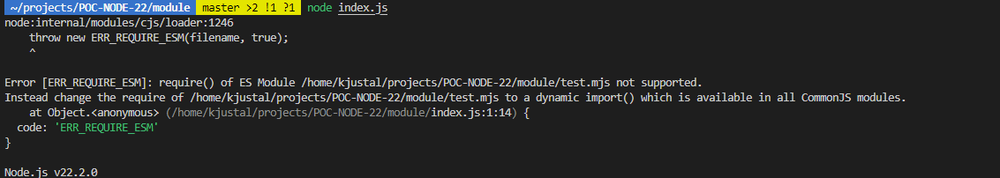
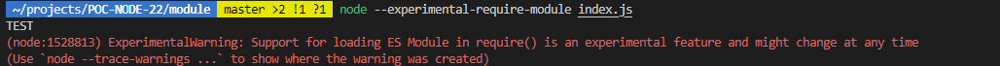

# POC-NODE-22

This project is a poc for testing the new feature of Node 22. The new version has been released in avril 2024 and will become the new LTS soon. In this project, I implemented ad put some clarity on the new features. In addition to what is under, we can also point the javascript version that has been upgraded to V8.

## Plan of the presentation

I explain with all the details how I build the project and my way of working.

- Support require()ing synchronous ESM graphs
- Running package.json scripts
- Stream default High Water Mark
- Watch Mode
- Websocket Client
- Glob/GlobSync
- Improve performance of AbortSignal creation
- Link

#### Support require()ing synchronous ESM graphs

You can now use module and mjs module using the "--experimental-require-module":





Run the following command:

```bash
$ node --run module
```

#### Running package.json scripts

No need to use the following command `npm run watch`, you can use node directly:

```bash
$ node --run watch
```

It will run the watch script located in the `package.json`.

#### Stream default High Water Mark

The high water mark is a parameter that sets a limit on the amount of data that can be stored in the internal stream buffer. When the limit is reached, Node stops reading more data until the buffer is emptied. This process is a security to limit the memory usage and prevent your application from crashing. This limit is a threshold, not a hard limit!

This parameter is tricky. If set too low, the program might take a while to execute very long process requiring a log of information from a stream. If set too high, you might crash your application with a java heap limit exception.

The default value of stream has been increased by default from 16kiB to 64KiB.

In order to see this, just run the following command:

```bash
$ node --run highWaterMark
```


As you can see, it is way faster with the new high water mark limit but also consume obviously more memory.

In order to see the problem that you might encountered, you can limit the max memory allocated to the heap by playwing with the `max_old_space_size`:

```bash
$ node --run highWaterMark-limited
```

#### Watch Mode

Run the following command:

```bash
$ npm run watch
```

If you modify the `index.js` in the `watched` folder, the node will restart with the new code automatically.

You can test the performance between the two version with this:

```bash
$ hyperfine --warmup 3 'node --run performance' 'npm run performance'
```


#### Websocket Client

No need of dependencies for connection a node script to a websocket server.

```bash
$ cd websocket/server
$ npm run dev
```

You can now connect to the websocket server without any dependencies in the file `index.js` in the folder `websocket`.

```js
const socket = new WebSocket("ws://localhost:8080");

// Connection opened
socket.addEventListener("open", () => {
  socket.send("Hello Server!");
});
```

#### Glob/GlobSync

No need to import the glob function from [Glob npm](https://www.npmjs.com/package/glob).
You can use it directly from node:fs directly. Run the following command and check the content of the file `index.js` in the directory `glob`.

```bash
$ npm run glob
```

#### Improve performance of AbortSignal creation

Run the bun server, I am using for the test with the following command:

```bash
$ cd abort-signal/server
$ npm run dev
```

Node v22 improve the api abort on the fetch:

```js
const resp = await fetch("http://localhost:3000", {
    signal: AbortSignal.timeout(2000),
});
```

You can see the result in the file ``fetch.js` in the folder `abort-signal`. Run the following command:

```bash
$ npm run abort-signal
```

## Link

[Node 22](https://nodejs.org/en/blog/announcements/v22-release-announce#improve-performance-of-abortsignal-creation)
[Node 22 - Testing](https://blog.appsignal.com/2024/05/07/whats-new-in-nodejs-22.html)
[AbortSignal Explanation deep](https://openjsf.org/blog/using-abortsignal-in-node-js)
